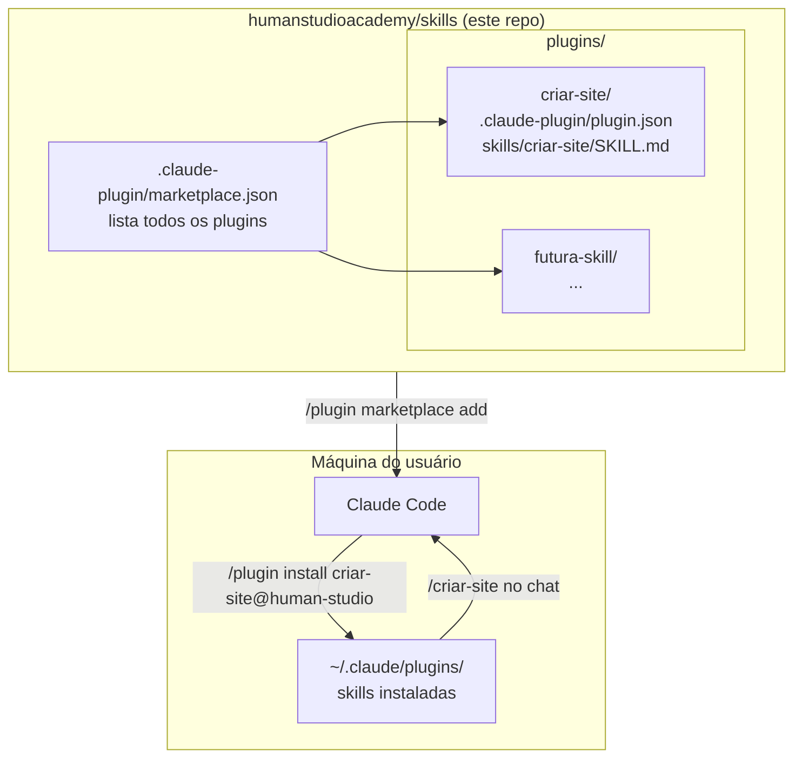

<div align="center">

# 🧠 Human Studio — Skills Marketplace

**Marketplace open-source de skills opinionadas para o [Claude Code](https://docs.claude.com/claude-code).**

Cada skill aqui dentro é uma habilidade pronta pra uso, instalável em 2 comandos, com workflow definido, prompt-engineering destilado e código auditável.

[](https://github.com/humanstudioacademy/skills/actions/workflows/validate.yml)
[](https://github.com/humanstudioacademy/skills/actions/workflows/security.yml)
[](LICENSE)
[](https://docs.claude.com/claude-code)
[](https://www.python.org)
[](#-skills-disponíveis)
[](https://github.com/humanstudioacademy/skills/commits/main)

[Instalar](#-instalação-rápida) · [Skills](#-skills-disponíveis) · [Arquitetura](#%EF%B8%8F-arquitetura) · [Adicionar skill](#%EF%B8%8F-como-adicionar-uma-skill-nova) · [Segurança](#-segurança)

</div>

---

## ⚡ Instalação rápida

Dentro do Claude Code (CLI ou Desktop):

```bash
/plugin marketplace add humanstudioacademy/skills
/plugin install criar-site@human-studio
```

Pronto. A skill `/criar-site` está disponível em qualquer projeto.

> Para listar todas as skills: `/plugin marketplace list human-studio`
> Para atualizar: `/plugin marketplace update human-studio`

---

## 🎨 Skills disponíveis

<table>
<tr>
<td width="50%" valign="top">

### 🏗️ [`criar-site`](plugins/criar-site/)

Gera **site responsivo end-to-end** (Astro + Tailwind) com imagens e vídeos de IA.

- Briefing conversado em **3 fases**
- 3 matrizes estéticas hibridáveis: Portfolio Editorial, Clínica Estética, Tech Apple-ish
- 2 modos: **API** (Freepik) ou **Manual** (qualquer plataforma de geração)
- Saída: site Astro + assets de IA + preview local

**Comando:** `/criar-site`
**Tempo médio:** 30–90 min do briefing ao site no ar

</td>
<td width="50%" valign="top">

### ➕ [Sua skill aqui](#%EF%B8%8F-como-adicionar-uma-skill-nova)

Quer contribuir? Mais skills serão adicionadas conforme amadurecemos. Cada uma vira um plugin instalável independente.

**Roadmap:** revisão de pitch, briefing de identidade visual, redator de copy editorial, auditoria de UX.

Tem ideia? [Abre uma issue](https://github.com/humanstudioacademy/skills/issues/new) ou manda PR.

</td>
</tr>
</table>

---

## 🏗️ Arquitetura



A engine: **um `marketplace.json` na raiz** lista plugins. **Cada plugin** tem seu próprio `plugin.json` e uma ou mais skills em `skills/<nome>/SKILL.md`. O Claude Code resolve tudo automaticamente.

### Layout do repositório

```
.
├── .claude-plugin/
│   └── marketplace.json              ← declara o marketplace e os plugins
├── .github/
│   └── workflows/
│       ├── validate.yml              ← CI: estrutura, JSON, py_compile
│       └── security.yml              ← CI: gitleaks + bloqueio de .env
├── plugins/
│   └── criar-site/
│       ├── .claude-plugin/
│       │   └── plugin.json           ← manifest do plugin
│       ├── skills/
│       │   └── criar-site/
│       │       ├── SKILL.md          ← workflow das 9 etapas
│       │       ├── LESSONS.md        ← 24 regras universais
│       │       ├── composer.py       ← sintetizador de templates
│       │       ├── hub.py            ← wrapper Freepik API
│       │       ├── prompt_engineer.py
│       │       ├── prompts/          ← Camada 1 + taxonomy
│       │       ├── templates/        ← 3 matrizes Astro
│       │       └── ref-prompt-engeneer/
│       ├── README.md
│       ├── INSTALL.md
│       └── SHARING.md
├── scripts/
│   └── validate_marketplace.py       ← validador rodado pelo CI
├── LICENSE                           ← MIT
├── SECURITY.md                       ← política de segurança
├── .gitignore
└── README.md                         ← este arquivo
```

---

## 📦 Instalação detalhada

Três métodos, do mais simples ao mais hands-on:

### Método A — Marketplace (recomendado)

Para quem só quer **usar** as skills:

```bash
# Dentro do Claude Code
/plugin marketplace add humanstudioacademy/skills
/plugin install criar-site@human-studio
```

A skill é baixada pra `~/.claude/plugins/` e fica disponível em qualquer projeto. Atualizações via `/plugin marketplace update human-studio`.

### Método B — Symlink local (para devs e contribuidores)

Para quem quer **editar** uma skill enquanto usa:

```bash
git clone https://github.com/humanstudioacademy/skills.git
cd skills

# macOS / Linux
mkdir -p ~/.claude/skills
ln -s "$(pwd)/plugins/criar-site/skills/criar-site" ~/.claude/skills/criar-site

# Windows (PowerShell, com privilégio de symlink habilitado)
New-Item -ItemType SymbolicLink -Path "$env:USERPROFILE\.claude\skills\criar-site" `
    -Target "$pwd\plugins\criar-site\skills\criar-site"
```

Edita os arquivos no clone, recarrega no Claude Code (`/restart`), as mudanças aparecem.

### Método C — Cópia manual (sem git)

Para quem precisa instalar offline ou em ambiente sandboxed:

```bash
# Baixe o ZIP do GitHub e descompacte
cp -r plugins/criar-site/skills/criar-site ~/.claude/skills/
```

---

## 🛠️ Como adicionar uma skill nova

Walkthrough mínimo pra contribuir uma skill ao marketplace:

### 1. Crie a estrutura

```bash
mkdir -p plugins/<nome>/.claude-plugin
mkdir -p plugins/<nome>/skills/<nome>
```

### 2. Crie `plugins/<nome>/.claude-plugin/plugin.json`

```json
{
  "name": "<nome>",
  "version": "0.1.0",
  "description": "Frase curta — o que a skill faz.",
  "author": { "name": "Seu Nome" },
  "license": "MIT",
  "keywords": ["..."]
}
```

### 3. Crie `plugins/<nome>/skills/<nome>/SKILL.md`

Frontmatter obrigatório:

```markdown
---
name: <nome>
description: Frase com gatilhos de ativação (quando o Claude deve invocar).
---

# /<nome>

## Quando ativar
...

## Workflow
...
```

> A `description` é o que o Claude usa pra decidir invocar a skill. Inclua palavras-chave concretas que o usuário tipicamente diria.

### 4. Adicione a entry no `marketplace.json`

```json
{
  "plugins": [
    { "name": "criar-site", "source": "criar-site", "description": "..." },
    { "name": "<nome>",     "source": "<nome>",     "description": "..." }
  ]
}
```

`source` é relativo ao `pluginRoot` (`./plugins`).

### 5. Valide local antes do PR

```bash
python3 scripts/validate_marketplace.py
```

Saída esperada:

```
✅ marketplace válido — 2 plugin(s) verificado(s)
```

### 6. Abra PR

CI roda os mesmos checks. Se passar verde, mergeamos.

---

## ✅ Validação e testes

O repo tem **3 layers** de verificação automática a cada push:

| Layer | Ferramenta | O que verifica |
|---|---|---|
| **Estrutura** | [`scripts/validate_marketplace.py`](scripts/validate_marketplace.py) | `marketplace.json` válido, cada plugin tem `plugin.json` correto, cada skill tem frontmatter, nomes batem entre manifesto e diretório, nenhum `.env` tracked |
| **Sintaxe** | `py_compile` + `json.load` | Todo `.py` e `.json` parseiam |
| **Segredos** | [gitleaks](https://github.com/gitleaks/gitleaks) | Scan de chaves de API, tokens, credenciais no diff e histórico |

### Rodar testes localmente

```bash
# Validação estrutural completa
python3 scripts/validate_marketplace.py

# Sintaxe Python
python3 -m py_compile $(git ls-files '*.py')

# Sintaxe JSON
for f in $(git ls-files '*.json'); do python3 -m json.tool "$f" > /dev/null && echo "✅ $f"; done
```

### Status atual dos checks

Os badges no topo refletem o estado mais recente da branch `main`:

- 🟢 **validate** — estrutura + JSON + Python compilam
- 🟢 **security** — sem segredos tracked, gitleaks limpo

Quando algum vira 🔴, o repo está com problema **não-mergeable**. Não instale plugins de uma branch com check vermelho.

---

## 🔒 Segurança

Política completa em [`SECURITY.md`](SECURITY.md). Resumo:

- ✅ **Zero secrets tracked.** CI bloqueia `.env`, chaves, tokens.
- ✅ **MIT-licensed.** Todo código auditável antes de instalar.
- ✅ **Scan automático.** Gitleaks roda a cada push e semanalmente.
- ✅ **Skills declaram permissões.** Cada `SKILL.md` documenta o que lê/escreve/chama.
- ❌ **Sem telemetria.** Skills não enviam dados pra servidor nosso.

Encontrou vulnerabilidade? **Não abra issue público.** Mande email pra `humanstudio.ai@gmail.com` com subject `[SECURITY]`.

---

## 🤝 Contribuindo

PRs muito bem-vindos. Antes de mandar:

1. **Skill nova?** Siga o walkthrough acima e rode `validate_marketplace.py`.
2. **Bug fix?** Issue primeiro descrevendo o problema, depois PR com fix + caso reproduzível.
3. **Feedback de uso?** Issue com tag `feedback` — relatos de quebra ou pontos de fricção são ouro.

Tom esperado: pragmático, direto, sem fluff. Se a skill tem comportamento opinativo (e a maioria tem), justifique a decisão no `LESSONS.md` ou no PR.

---

## 📖 Documentação por skill

Cada plugin tem documentação própria, mais profunda:

| Skill | README | INSTALL | Detalhes técnicos |
|---|---|---|---|
| `criar-site` | [README](plugins/criar-site/README.md) | [INSTALL](plugins/criar-site/INSTALL.md) | [SKILL.md](plugins/criar-site/skills/criar-site/SKILL.md) · [LESSONS.md](plugins/criar-site/skills/criar-site/LESSONS.md) |

---

## 📜 Licença

[MIT](LICENSE) — uso livre comercial e pessoal, sem garantias.

---

<div align="center">

Feito com ☕ pelo [Human Studio](mailto:humanstudio.ai@gmail.com).
Powered by [Claude Code](https://docs.claude.com/claude-code).

</div>
